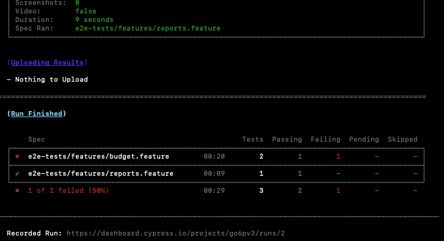
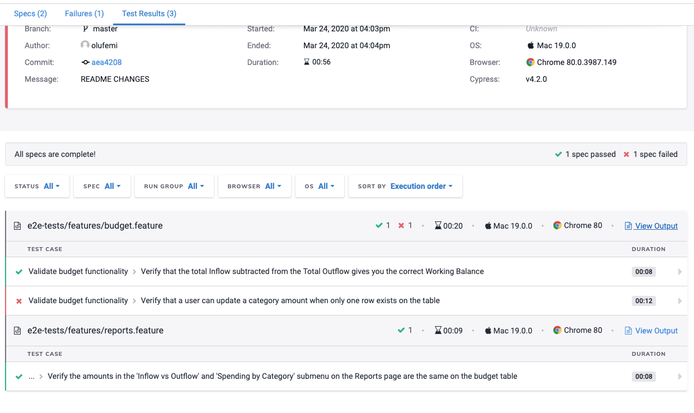

[![Powered by Modus_Create](https://img.shields.io/badge/powered_by-Modus_Create-blue.svg?longCache=true&style=flat&logo=data:image/svg+xml;base64,PHN2ZyB2aWV3Qm94PSIwIDAgMzIwIDMwMSIgeG1sbnM9Imh0dHA6Ly93d3cudzMub3JnLzIwMDAvc3ZnIj4KICA8cGF0aCBkPSJNOTguODI0IDE0OS40OThjMCAxMi41Ny0yLjM1NiAyNC41ODItNi42MzcgMzUuNjM3LTQ5LjEtMjQuODEtODIuNzc1LTc1LjY5Mi04Mi43NzUtMTM0LjQ2IDAtMTcuNzgyIDMuMDkxLTM0LjgzOCA4Ljc0OS01MC42NzVhMTQ5LjUzNSAxNDkuNTM1IDAgMCAxIDQxLjEyNCAxMS4wNDYgMTA3Ljg3NyAxMDcuODc3IDAgMCAwLTcuNTIgMzkuNjI4YzAgMzYuODQyIDE4LjQyMyA2OS4zNiA0Ni41NDQgODguOTAzLjMyNiAzLjI2NS41MTUgNi41Ny41MTUgOS45MjF6TTY3LjgyIDE1LjAxOGM0OS4xIDI0LjgxMSA4Mi43NjggNzUuNzExIDgyLjc2OCAxMzQuNDggMCA4My4xNjgtNjcuNDIgMTUwLjU4OC0xNTAuNTg4IDE1MC41ODh2LTQyLjM1M2M1OS43NzggMCAxMDguMjM1LTQ4LjQ1OSAxMDguMjM1LTEwOC4yMzUgMC0zNi44NS0xOC40My02OS4zOC00Ni41NjItODguOTI3YTk5Ljk0OSA5OS45NDkgMCAwIDEtLjQ5Ny05Ljg5NyA5OC41MTIgOTguNTEyIDAgMCAxIDYuNjQ0LTM1LjY1NnptMTU1LjI5MiAxODIuNzE4YzE3LjczNyAzNS41NTggNTQuNDUgNTkuOTk3IDk2Ljg4OCA1OS45OTd2NDIuMzUzYy02MS45NTUgMC0xMTUuMTYyLTM3LjQyLTEzOC4yOC05MC44ODZhMTU4LjgxMSAxNTguODExIDAgMCAwIDQxLjM5Mi0xMS40NjR6bS0xMC4yNi02My41ODlhOTguMjMyIDk4LjIzMiAwIDAgMS00My40MjggMTQuODg5QzE2OS42NTQgNzIuMjI0IDIyNy4zOSA4Ljk1IDMwMS44NDUuMDAzYzQuNzAxIDEzLjE1MiA3LjU5MyAyNy4xNiA4LjQ1IDQxLjcxNC01MC4xMzMgNC40Ni05MC40MzMgNDMuMDgtOTcuNDQzIDkyLjQzem01NC4yNzgtNjguMTA1YzEyLjc5NC04LjEyNyAyNy41NjctMTMuNDA3IDQzLjQ1Mi0xNC45MTEtLjI0NyA4Mi45NTctNjcuNTY3IDE1MC4xMzItMTUwLjU4MiAxNTAuMTMyLTIuODQ2IDAtNS42NzMtLjA4OC04LjQ4LS4yNDNhMTU5LjM3OCAxNTkuMzc4IDAgMCAwIDguMTk4LTQyLjExOGMuMDk0IDAgLjE4Ny4wMDguMjgyLjAwOCA1NC41NTcgMCA5OS42NjUtNDAuMzczIDEwNy4xMy05Mi44Njh6IiBmaWxsPSIjRkZGIiBmaWxsLXJ1bGU9ImV2ZW5vZGQiLz4KPC9zdmc+)](https://moduscreate.com)

# A SIMPLE TEST PLAN AND CYPRESS AUTOMATION ON E2E TESTS: BUDGETING APP

## Test Plan

#### INTRODUCTION

This is a simple budget management application. It tracks inflow and outflow, shows remaining budget, and interesting reports with charts.
As such, it offers more features than the usual Todo App.

#### OBJECTIVE

The objective of this test plan, is to identify and test E2E positive and negative scenarios. 

#### TASKS

Identify Edge Cases (Usability, Functional and E2E tests)
Automated Tests E2E tests

#### SCOPE:

These tests are limited to only functional E2E tests via the GUI. We will not be running any integration, unit, contract or other forms of testing.

#### Test Strategy

Exploratory testing will be conducted, to derive Usability testing scenarios and Functional testing scenarios. E2E tests will be automated with Cypress and will be able to run headless via the CI.

### TEST SCENARIOS

### Usability Testing

#### Budget Page
1. Budget Link should be displayed, and clickable
2. Balance Component should be displayed, with Total Inflow, Total Outflow, and Working Balance.
3. Table with Category Description and Amount should be displayed and properly aligned.
4. Check if each row on the table is clickable and can be updated, canceled, or deleted.
5. Check that new category, description and amount can be added to the table
6. Scrolling on each row on the table should be highlighted in grey
7. Balance Component cannot be edited.
8. Total inflow should be in green color
9. Total Outflow should be in red color
10. Working Balance should be in green color when Total inflow is greater than Outflow.
11. Working Balance should be red when Total inflow is less than Outflow `(FAIL)`
12. User should be prompted to include Income for Total Inflow `(FAIL)`
13. Check that 'ADD' button remains grey when Category, Description, and Amount is not filled up
14. Check that 'ADD' button becomes green when Category, Description, and Amount is filled up
15. Check that you cannot edit a category amount from a positive value to a negative value `(Please check with the PO)`.
16. When a new Category is added, the Balance Component should be updated
17. Budget, Reports, Star, Fork and Modus Icon should all be displayed on the header




#### Reports Page
1. Reports Link should be displayed, clickable and should work properly
2. Reports Link should be highlighted when clicked and loaded
3. Inflow vs. Outflow and Spending Category sub menus should be displayed
4. Check that Inflow vs. Outflow sub-menu loads page with a bar chart of Inflow and Outflow
5. Check that in Inflow vs. Outflow each color matches each legend in the bar chart
6. Check that in Inflow vs. Outflow the amounts are proportionate to the representation on the bar chart legends
7. Check Spending by Category sub-menu loads page with a pie chart of Inflow and Outflow
8. Check that in Spending by Category each color matches each legend in the pie chart
9. Check that in Spending by Category the amounts are proportionate to the representation on the pie chart

### Functional Testing


#### Budget Page
1. Verify that Total Inflow subtracted from the Total Outflow gives you the correct Working Balance 
2. Verify that new Categories, Description, and Value can be added.
3. Verify that ADD button is not enabled when alphabets are inputted into the Value text field
4. Verify that JS validation does not allow symbols to be inputted into the Value text field
5. Verify that Income is added to the table as an Inflow value and updated to Total Inflow 
6. Verify that only Income should be added to Total Inflow. `(Please check with the PO)`
7. Verify that all Categories except Income are added to the table as an Outflow value and updated to Total Outflow
8. Verify that updated or deleted values are updated in the Balance Component
9. Verify that a user cannot edit a category amount from a positive value to a negative value `(Please check with the PO`).
10. Verify that a category changed from a non-income Item to Income should automatically change Amount to an Inflow amount and not Outflow. `(Please check with the PO)`.
11. Verify that a category cannot be changed from a non-income Item to Income. `(Please check with the PO)`.


#### Reports Page
1. Verify that the total amounts displayed in the Budget page is reflected on the Inflow vs. Outflow Bar charts
2. Verify that Income from the table should not be shown as a legend in reports. `(Please check with the PO`).
3. Verify that the legends in the 'Inflow vs Outflow' and 'Spending by Category' submenu amounts are the same on the budget table
4. Verify that only categories that are in the table are reflected on the legends 
5. Verify that duplicate categories found in the budget table, have their amounts added and reflected as one legend on the Reports Page
6. Verify that Income from budget table should not be shown as a legend in reports. `(Please check with the PO)`.



### E2E Testing Scenarios

- [x] Feature: Validate budget functionality

        As a user
        I want to validate my budget

- [x] Scenario: Verify that the total Inflow subtracted from the Total Outflow gives you the correct Working Balance 

        Given a user is on the budget page with an empty budget
        When the user adds an outflow category ‘Car' description ‘new car’ value ‘500'
        And the user adds an inflow category ‘Income' description ‘Paycheck’ value ‘1000'
        Then the total inflow should be ‘$1,000.00’ and total Outflow ‘$500.00’ and working Balance ‘$1,500.00’



- [x] Scenario: Verify that a user can update a category amount when only one row exists on the table

        Given a user is on the budget page with an empty budget
        When the user adds an inflow category ‘Income' and description ‘Paycheck’ and value ‘1000'
        Then the user should be able to update the amount "500"
        
********************
- [x] Feature: Validate reports functionality

        As a user
        I want to validate my reports

- [x] Scenario: Verify the amounts in the 'Inflow vs Outflow' and 'Spending by Category' submenu on the Reports page are the same on the budget table

        Given a user is on the budget page with an empty budget
        When the user adds an outflow category "Car" description "new car" value "500"
        And the user adds an inflow category "Income" description "Paycheck" value "1000"
        And navigates to the Reports Page Inflow vs Outflow menu
        Then the Inflow should be ‘1,000.00’ and the outflow should be ‘500.00’

********************

# CYPRESS AUTOMATION

Three E2E Scenarios run, with one failing Scenario (Verify that a user can update a category amount when only one row exists on the table), 
This is actually a bug, as we cannot update the table when we have only one Item on it. 

### BUILD

### To Run
- `npm run cy:run-chrome` Run Test in Chrome Interactive mode
- `npm run cy:run-firefox`  Run Test in FireFox Interactive mode
- `npm run cy:run-electron` Run Test in Electron Interactive mode
- `npm run cy:run-dashboard` Run Test headless with dashboard for test html report

To view report please run test in CLI and look for HTML Report Link at the end of Test
> 
>

## TEST RUN EXAMPLE

